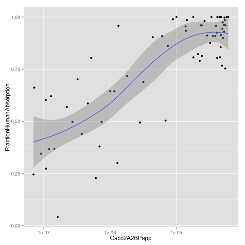
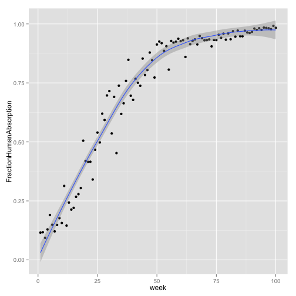
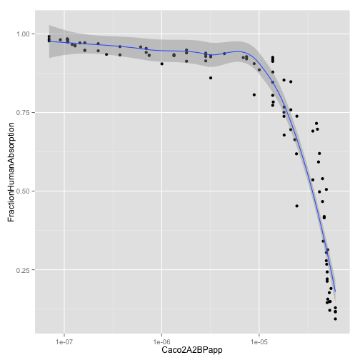

# Example code and data for "Practical Data Science with R" by Nina Zumel and John Mount, Manning 2014.


 * The book: ["Practical Data Science with R" by Nina Zumel and John Mount, Manning 2014](http://www.manning.com/zumel/) (book copyright Manning Publications Co., all rights reserved)
 * The support site: [GitHub WinVector/zmPDSwR](https://github.com/WinVector/zmPDSwR)


## The code and data in this directory supports examples from:
 * Appendix B: Some Important Statistical Concepts

## Bioavailability example data

This data is transcribed from Figure 4 of the public promotional material found at: [Caco-2 Permeability Assay](http://www.cyprotex.com/admepk/in-vitro-permeability/caco-2-permeability/) and was converted to numeric estimates using [WebPlotDigitizer](http://arohatgi.info/WebPlotDigitizer/).  This may seem a bit aggressive, but such actions are allowed under [fair use](http://en.wikipedia.org/wiki/Fair_use) (one of the rights copyright holders must grant in return for government copyright protection; in this case we meet many of the intended terms/factors of fair use:  we are using for research of a small amount factual data with no negative effect on the original).  Also, a data scientist is going to have to get use to doing some work to get data.

The original Figure 4 is:


This graph relates the measured rate of [Caco2](http://en.wikipedia.org/wiki/Caco-2) permeability which is how fast a molecule travels across a monolayer of cells derived from a large intestine carcinoma.  The hope is that even though the immortal cell culture is not a working organ that Caco2 permeability rates predict how much of a drug will be ingested through a human small intestine (before passing to the large intestine, which is less involved in complicated molecule absorption than the small intestine).  You can see Caco2 is a test by analogy: whole human absorption is estimated from a cell culture using different mechanisms than the actual complete human body.  So Caco2 doesn't determine the [ADME](http://en.wikipedia.org/wiki/ADME) properties of a drug, but is considered a useful correlated signal or feature to measure.

Estimated data from the graph is stored in [caco2.csv](caco2.csv), which produces the following graph:


```r
library(ggplot2)
d <- read.table('caco2.csv',header=T,sep=',')
ggplot(d,aes(x=Caco2A2BPapp,y=FractionHumanAbsorption)) +
   geom_point() + scale_x_log10() + geom_smooth()
```

```
## geom_smooth: method="auto" and size of largest group is <1000, so using loess. Use 'method = x' to change the smoothing method.
```

 


This allows us to build a very crude logistic model (Beta regression would also be appropriate here) relating Caco2 permeability rate to human intestinal absorption:


```r
model <- glm(data=d, FractionHumanAbsorption~log(Caco2A2BPapp),
   family=binomial(link='logit'))
```

```
## Warning: non-integer #successes in a binomial glm!
```

```r
print(summary(model))
```

```
## 
## Call:
## glm(formula = FractionHumanAbsorption ~ log(Caco2A2BPapp), family = binomial(link = "logit"), 
##     data = d)
## 
## Deviance Residuals: 
##     Min       1Q   Median       3Q      Max  
## -0.8834  -0.1819   0.0211   0.3250   0.7046  
## 
## Coefficients:
##                   Estimate Std. Error z value Pr(>|z|)    
## (Intercept)          7.489      1.921    3.90  9.7e-05 ***
## log(Caco2A2BPapp)    0.499      0.144    3.48  0.00051 ***
## ---
## Signif. codes:  0 '***' 0.001 '**' 0.01 '*' 0.05 '.' 0.1 ' ' 1
## 
## (Dispersion parameter for binomial family taken to be 1)
## 
##     Null deviance: 23.4519  on 67  degrees of freedom
## Residual deviance:  8.8853  on 66  degrees of freedom
## AIC: 47.08
## 
## Number of Fisher Scoring iterations: 5
```

```r
d$model <- predict(model,newdata=d,type='response')
ggplot(d) +
   geom_point(aes(x=Caco2A2BPapp,y=FractionHumanAbsorption)) + 
   geom_line(aes(x=Caco2A2BPapp,y=model)) +
   scale_x_log10()
```

 

```r
Intercept <- model$coefficients['(Intercept)']
print(Intercept)
```

```
## (Intercept) 
##       7.489
```

```r
cacoEffect <- model$coefficients['log(Caco2A2BPapp)']
print(cacoEffect)
```

```
## log(Caco2A2BPapp) 
##            0.4992
```


This gives us the estimate that log() increase of cm/s unit measured of Caco2 permeability tends to increase the logit of human intestinal absorption fraction by 0.4992.  Which we will use to produce our deliberately problematic synthetic example.

What we want is a data-set that might be typical of a drug series being optimized.  In projects as intense as drug optimization you see early candidate drugs "that have all the typical features" and work okay.  Later candidate drugs tend to work better (the optimization) but often don't have as many of the features that were thought to be important early in the project (as the feature relations are not strict, and it is not always possible for a drug candidate to simultaneously be the best on many different scales).

So you would expect to see the percent human absorption going up over time (as better and better drug candidates are made).  If the initial candidate drugs were optimized for Caco2 permeability you might also see Caco2 permeability go down as actual human ADME is optimized (as we move away from the initial Caco2 favored candidates).  A naive analysis of only data from such a series could easily (through [omitted variable bias](http://en.wikipedia.org/wiki/Omitted-variable_bias) (see also [confounding variables](http://en.wikipedia.org/wiki/Confounding_variable) and [nuisance variables](http://en.wikipedia.org/wiki/Nuisance_variable)) imply a relation that good Caco2 relates to bad ADME (when in fact we tend to believe good Caco2 relates to good ADME).  This is why you can not always get away with a simple every variable is equal "spray and pray" style of data analysis.


Our synthetic data set is given as:

```r
set.seed(2535251)
s <- data.frame(week=1:100)
s$Caco2A2BPapp <- sort(sample(d$Caco2A2BPapp,100,replace=T),decreasing=T)
sigmoid <- function(x) {1/(1+exp(-x))}
s$FractionHumanAbsorption <- 
 sigmoid(Intercept + cacoEffect*log(s$Caco2A2BPapp) + 
   s$week/10 - mean(s$week/10) +
   rnorm(100)/3)
write.table(s,'synth.csv',sep=',',quote=F,row.names=F)
save(s,d,file='synth.RData')
```


What we have done is simulate a drug optimization managed to increase human intestine absorption (presumably by making changes that directly worked in that domain) that happened to lose Caco2 permeability as we went.  Remember there is not a completely causal relation between Caco2 permeability and absorption in the human small intestine- but they are correlated through many shared factors (and are not identical because of many un-shared factors).


```r
ggplot(s,aes(x=week,y=FractionHumanAbsorption)) +
   geom_point() + geom_smooth()
```

```
## geom_smooth: method="auto" and size of largest group is <1000, so using loess. Use 'method = x' to change the smoothing method.
```

 


By design the Caco2 permeability remains is in fact a plus for human intestine absorption throughout this data set, it is just that other effects (changing over time) are dominating.  But as we watch the data over time we see human intestine absorption increasing over time and Caco2 permeability dropping over time: leading to a spurious observation of an inverse correlation.
We are assuming that everything that improves both Caco2 and human intestinal absorption was tried at the beginning of the project, and that for the part of the project we now see the group is trying things that directly improve human intestine absorption even when they are known to harm Caco2.  The group would like high Caco2, but it is secondary to the more direct measurement of human intestinal absorption- so they are willing to make more and more trade-offs as the project gets further along.  The time/week variable is standing in for all of these actual omitted factors.


```r
print(summary(glm(data=s, FractionHumanAbsorption~log(Caco2A2BPapp),
   family=binomial(link='logit'))))
```

```
## Warning: non-integer #successes in a binomial glm!
```

```
## 
## Call:
## glm(formula = FractionHumanAbsorption ~ log(Caco2A2BPapp), family = binomial(link = "logit"), 
##     data = s)
## 
## Deviance Residuals: 
##    Min      1Q  Median      3Q     Max  
## -0.609  -0.246  -0.118   0.202   0.557  
## 
## Coefficients:
##                   Estimate Std. Error z value Pr(>|z|)    
## (Intercept)        -10.003      2.752   -3.64  0.00028 ***
## log(Caco2A2BPapp)   -0.969      0.257   -3.77  0.00016 ***
## ---
## Signif. codes:  0 '***' 0.001 '**' 0.01 '*' 0.05 '.' 0.1 ' ' 1
## 
## (Dispersion parameter for binomial family taken to be 1)
## 
##     Null deviance: 43.7821  on 99  degrees of freedom
## Residual deviance:  9.4621  on 98  degrees of freedom
## AIC: 64.7
## 
## Number of Fisher Scoring iterations: 6
```

```r
ggplot(s,aes(x=Caco2A2BPapp,y=FractionHumanAbsorption)) +
    geom_point() + scale_x_log10() + geom_smooth()
```

```
## geom_smooth: method="auto" and size of largest group is <1000, so using loess. Use 'method = x' to change the smoothing method.
```

 


As you can see the deliberately inserted positive relation between log(Caco2) and absorption is hidden and lost on simple analyses.  The warning point to look for is "the sign of the Caco2 coefficient seems wrong."  The issue is that week and log(Caco2) are (negatively) correlated, so if one is missing the opposite of the other can be used as substitute for prediction (leading to confusing coefficients).  This is a reminder that even a model making good predictions may not be actually be a good explanation.

One way to fix this is to introduce candidate variables and re-try the modeling.  In our example the omitted variable will be date (which is often a good candidate).  Other ways to deal with the problem could be through appropriate [fixed effects models](http://en.wikipedia.org/wiki/Fixed_effects_model), [random effects models](http://en.wikipedia.org/wiki/Random_effects_model), control of priors, use of hierarchical models, control of regularization or forcing orthogonalization of variables.

So, to fix our problem we have to at least fit jointly with the omitted variable:


```r
print(summary(glm(data=s,FractionHumanAbsorption~week+log(Caco2A2BPapp),
   family=binomial(link='logit'))))
```

```
## Warning: non-integer #successes in a binomial glm!
```

```
## 
## Call:
## glm(formula = FractionHumanAbsorption ~ week + log(Caco2A2BPapp), 
##     family = binomial(link = "logit"), data = s)
## 
## Deviance Residuals: 
##     Min       1Q   Median       3Q      Max  
## -0.3474  -0.0568  -0.0010   0.0709   0.3038  
## 
## Coefficients:
##                   Estimate Std. Error z value Pr(>|z|)   
## (Intercept)         3.1413     4.6837    0.67   0.5024   
## week                0.1033     0.0386    2.68   0.0074 **
## log(Caco2A2BPapp)   0.5689     0.5419    1.05   0.2938   
## ---
## Signif. codes:  0 '***' 0.001 '**' 0.01 '*' 0.05 '.' 0.1 ' ' 1
## 
## (Dispersion parameter for binomial family taken to be 1)
## 
##     Null deviance: 43.7821  on 99  degrees of freedom
## Residual deviance:  1.2595  on 97  degrees of freedom
## AIC: 47.82
## 
## Number of Fisher Scoring iterations: 6
```

Note: since we are guessing both variables and variable transforms (log()) this problem would be a good candidate for using a generalized additive model (as in the GAM package).

Notice we got reasonable (but not great) estimates of the coefficients for week and Caco2 effects (though we did not achieve significance on the Caco2 effect estimate).  But we may not always have data that is diverse enough to effect such a recovery (even when we correctly supply the omitted variable).  When that doesn't work we need to try and force effects onto the omitted variable.  At this point you have trouble and methods don't always give you all of what you want.  For example you might try to force all of the explanatory value onto the week variable by using R's offset command (a technique that allows us to fit residuals in many circumstances see help(offset) and help(formula)):


```r
mF <- glm(data=s, FractionHumanAbsorption~week,
    family=binomial(link='logit'))
```

```
## Warning: non-integer #successes in a binomial glm!
```

```r
weekEffect <- mF$coefficients['week']
print(summary(mF))
```

```
## 
## Call:
## glm(formula = FractionHumanAbsorption ~ week, family = binomial(link = "logit"), 
##     data = s)
## 
## Deviance Residuals: 
##     Min       1Q   Median       3Q      Max  
## -0.3037  -0.1312  -0.0575   0.0776   0.3833  
## 
## Coefficients:
##             Estimate Std. Error z value Pr(>|z|)    
## (Intercept)  -1.8130     0.5499   -3.30  0.00098 ***
## week          0.0676     0.0142    4.77  1.8e-06 ***
## ---
## Signif. codes:  0 '***' 0.001 '**' 0.01 '*' 0.05 '.' 0.1 ' ' 1
## 
## (Dispersion parameter for binomial family taken to be 1)
## 
##     Null deviance: 43.7821  on 99  degrees of freedom
## Residual deviance:  2.3203  on 98  degrees of freedom
## AIC: 49.78
## 
## Number of Fisher Scoring iterations: 6
```

```r
print(summary(glm(data=s,FractionHumanAbsorption~log(Caco2A2BPapp) +
   offset(weekEffect*week),
   family=binomial(link='logit'))))
```

```
## Warning: non-integer #successes in a binomial glm!
## Warning: non-integer #successes in a binomial glm!
```

```
## 
## Call:
## glm(formula = FractionHumanAbsorption ~ log(Caco2A2BPapp) + offset(weekEffect * 
##     week), family = binomial(link = "logit"), data = s)
## 
## Deviance Residuals: 
##     Min       1Q   Median       3Q      Max  
## -0.3274  -0.1184  -0.0209   0.1050   0.3815  
## 
## Coefficients:
##                   Estimate Std. Error z value Pr(>|z|)
## (Intercept)        -0.9283     2.1973   -0.42     0.67
## log(Caco2A2BPapp)   0.0818     0.2007    0.41     0.68
## 
## (Dispersion parameter for binomial family taken to be 1)
## 
##     Null deviance: 2.3203  on 99  degrees of freedom
## Residual deviance: 2.1663  on 98  degrees of freedom
## AIC: 51.41
## 
## Number of Fisher Scoring iterations: 6
```


Notice our estimate of both the week coefficient and the log(Caco2) coefficients are much worse in this case.  So offset is not a silver bullet (though it did at least get the sign of the log(Caco2) coefficient right, but did not achieve significance for the estimate).


Document rendering command (in bash):
```
echo "library('knitr'); knit('README.Rmd')" | R --vanilla ; pandoc -o README.html README.md
```
